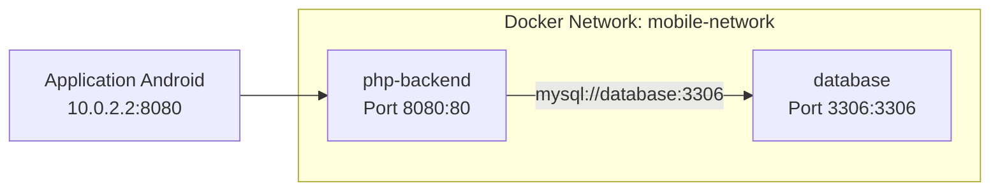
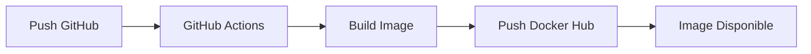
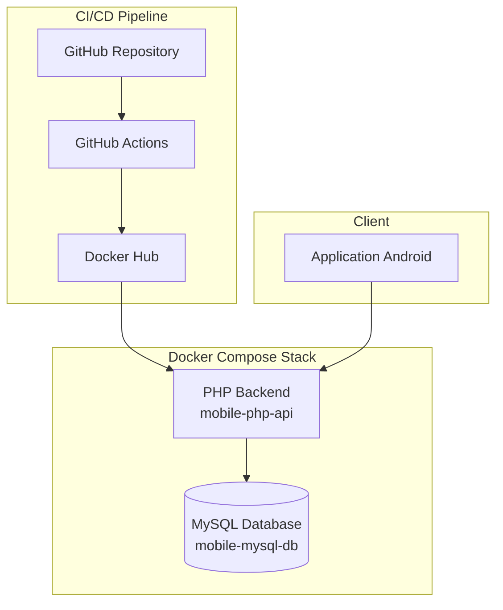

# TP DevOps : Déploiement d'une Architecture Mobile

> **Rapport de Travaux Pratiques**  
> **Sujet** : Mise en place d'une chaîne DevOps pour une architecture client-serveur mobile  
> **Date** : Janvier 2026

---

## Table des Matières

1. [Introduction et Contexte](#1-introduction-et-contexte)
2. [Environnement Technique](#2-environnement-technique)
3. [Module 1 : Persistance des Données](#3-module-1--persistance-des-données)
4. [Module 2 : Orchestration Docker Compose (Partie 1)](#4-module-2--orchestration-docker-compose-partie-1)
5. [Module 3 : Conteneurisation de l'API](#5-module-3--conteneurisation-de-lapi)
6. [Module 4 : Orchestration Complète (Partie 2)](#6-module-4--orchestration-complète-partie-2)
7. [Module 5 : Registre d'Images Docker Hub](#7-module-5--registre-dimages-docker-hub)
8. [Module 6 : Intégration Continue GitHub Actions](#8-module-6--intégration-continue-github-actions)
9. [Conclusion](#9-conclusion)

---

## 1. Introduction et Contexte

### 1.1 Problématique

Ce TP DevOps aborde deux problématiques classiques du développement logiciel :

**Scénario A : "Ça marche chez moi"**
- **Contexte** : Deux développeurs collaborent (Backend et Mobile)
- **Problème** : Configurations différentes (base de données, versions de Java)
- **Conséquence** : Perte de temps significative pour la synchronisation des environnements

**Scénario B : Dépendances non reproductibles**
- **Contexte** : Application Python/TensorFlow développée localement
- **Problème** : Bibliothèques manquantes ou OS différent lors des démonstrations
- **Solution** : Conteneurisation avec Docker

### 1.2 Objectifs du TP

Mettre en place une chaîne DevOps complète pour une architecture client-serveur mobile incluant :
- Conteneurisation de la base de données et de l'API Backend
- Orchestration des services avec Docker Compose
- Publication sur Docker Hub
- Pipeline CI/CD avec GitHub Actions

---

## 2. Environnement Technique

| Outil | Version | Rôle dans le projet |
|-------|---------|---------------------|
| Docker | 27.5.0 | Moteur de conteneurisation |
| Docker Compose | v2.32.3 | Orchestration multi-conteneurs |
| MySQL | 8.x | SGBD relationnel pour persistance |
| PHP | 8.2 | Langage Backend (API REST) |
| Apache | 2.4 | Serveur web pour API |
| Git | 2.43+ | Contrôle de version |
| GitHub Actions | - | CI/CD automatisé |

---

## 3. Module 1 : Persistance des Données

### 3.1 Objectif
Configurer un conteneur PostgreSQL avec les contraintes de production et vérifier la persistance des données.

### 3.2 Configuration Appliquée

```bash
docker run -d \
  --name tp-postgres \
  -p 2345:5432 \
  -e POSTGRES_DB=mobile_backend_db \
  -e POSTGRES_USER=admin \
  -e POSTGRES_PASSWORD=securePass123 \
  --memory="50m" \
  --cpus="1.0" \
  -v "$(pwd)/db_data:/var/lib/postgresql/data" \
  postgres:15
```

### 3.3 Structure de la Base de Données

```sql
CREATE EXTENSION IF NOT EXISTS "uuid-ossp";

CREATE TABLE mobile_sessions (
    device_id UUID NOT NULL PRIMARY KEY,
    model_name varchar(100) NOT NULL,
    last_login TIMESTAMP DEFAULT CURRENT_TIMESTAMP
);

INSERT INTO mobile_sessions (device_id, model_name) 
VALUES (gen_random_uuid(), 'Android Device 1');
```

### 3.4 Réponses aux Questions du TP

| Question | Réponse |
|----------|---------|
| Où sont stockées les données ? | Dans le volume Docker `db_data` mappé au répertoire local `./db_data/` |
| Données après suppression sans volume ? | **Perdues** - Les données vivent dans le système de fichiers du conteneur |
| Données avec volume persistant ? | **Conservées** - Le volume survit à la destruction du conteneur |

### 3.5 Analyse des Métriques Docker

| Métrique | Valeur | Description |
|----------|--------|-------------|
| CPU % | 0.04% | Utilisation processeur minimale |
| MEM USAGE/LIMIT | 19.07MiB / 50MiB | Utilisation mémoire dans les limites |
| MEM % | 38.15% | Pourcentage de la limite mémoire utilisé |
| NET I/O | 1.17kB / 126B | Trafic réseau reçu/envoyé |
| BLOCK I/O | 0B / 4.1kB | Activité disque (lecture/écriture) |

### 3.6 Captures d'Écran - Module 1

````carousel

<!-- slide -->

<!-- slide -->

<!-- slide -->

<!-- slide -->

````

---

## 4. Module 2 : Orchestration Docker Compose (Partie 1)

### 4.1 Analyse de l'API Backend

**Technologie identifiée** : PHP / MySQL

**Structure du projet** :
- `connect.php` - Connexion à la base de données
- `functions.php` - Fonctions utilitaires de l'API
- `studentAPI/` - Endpoints REST pour la gestion des étudiants

**Points d'entrée API** :
| Endpoint | Méthode | Description |
|----------|---------|-------------|
| `addStudent.php` | POST | Ajouter un étudiant |
| `viewAllStudents.php` | GET | Lister tous les étudiants |
| `updateStudent.php` | PUT | Modifier un étudiant |
| `removeStudent.php` | DELETE | Supprimer un étudiant |

### 4.2 Fichier docker-compose.yml (Base de données)

```yaml
services:
  database:
    image: mysql:8
    container_name: mobile-mysql-db
    environment:
      MYSQL_DATABASE: ouareddb
      MYSQL_USER: admin
      MYSQL_PASSWORD: securePass123
      MYSQL_ROOT_PASSWORD: rootPassword
    ports:
      - "3306:3306"
    volumes:
      - mysql_data:/var/lib/mysql
    networks:
      - mobile-network
    deploy:
      resources:
        limits:
          memory: 300M
          cpus: '1.0'
```

### 4.3 Problèmes Rencontrés et Solutions

| Problème | Symptôme | Cause | Solution |
|----------|----------|-------|----------|
| **Erreur OOM** | MySQL tué (code 137) | Limite 50MB insuffisante pour MySQL 8 | Augmentation à 300MB |
| **Option obsolète** | `unknown variable 'default-authentication-plugin'` | MySQL 8 utilise `caching_sha2_password` | Retrait de l'option |
| **Driver manquant** | `could not find driver` | Extension PDO MySQL absente | Installation dans Dockerfile |

### 4.4 Réponse à la Question du TP

> **Question** : Pourquoi, sans la base de données lancée, le statut de l'application est-il en erreur ?

**Réponse** : L'API PHP (`connect.php`) tente une connexion PDO immédiate à MySQL au démarrage. Sans le conteneur MySQL en cours d'exécution, la connexion échoue avec l'erreur `Connection refused`, provoquant une exception PDO qui empêche le fonctionnement normal de l'API.

### 4.5 Captures d'Écran - Module 2

````carousel

<!-- slide -->

<!-- slide -->

<!-- slide -->

<!-- slide -->

<!-- slide -->

<!-- slide -->

````

---

## 5. Module 3 : Conteneurisation de l'API

### 5.1 Dockerfile Optimisé

```dockerfile
FROM php:8.2-apache

# Install MySQL PDO extension
RUN docker-php-ext-install pdo pdo_mysql

# Enable Apache mod_rewrite
RUN a2enmod rewrite

# Copy application files
COPY . /var/www/html/

# Set proper permissions
RUN chown -R www-data:www-data /var/www/html

EXPOSE 80
```

### 5.2 Caractéristiques Techniques

| Aspect | Détail |
|--------|--------|
| Image de base | `php:8.2-apache` |
| Extensions installées | PDO, PDO_MySQL |
| Modules Apache | mod_rewrite activé |
| Taille image | ~708MB (compressée ~176MB) |
| Port exposé | 80 |

### 5.3 Construction de l'Image

```bash
docker build -t mobile-php-api:latest .
```

### 5.4 Scripts d'Automatisation du Build

Trois scripts créés pour différentes plateformes :
- `build.sh` - Linux/macOS
- `build.bat` - Windows CMD
- `build.ps1` - Windows PowerShell

### 5.5 Capture d'Écran - Module 3


---

## 6. Module 4 : Orchestration Complète (Partie 2)

### 6.1 Configuration docker-compose.yml Complète

```yaml
services:
  # MySQL Database
  database:
    image: mysql:8
    container_name: mobile-mysql-db
    environment:
      MYSQL_DATABASE: ouareddb
      MYSQL_USER: admin
      MYSQL_PASSWORD: securePass123
      MYSQL_ROOT_PASSWORD: rootPassword
    ports:
      - "3306:3306"
    volumes:
      - mysql_data:/var/lib/mysql
    networks:
      - mobile-network
    deploy:
      resources:
        limits:
          memory: 300M
          cpus: '1.0'

  # PHP Backend API
  php-backend:
    build: .
    container_name: mobile-php-api
    ports:
      - "8080:80"
    volumes:
      - ./:/var/www/html/
    depends_on:
      - database
    networks:
      - mobile-network

volumes:
  mysql_data:

networks:
  mobile-network:
    driver: bridge
```

### 6.2 Configuration Réseau



| Aspect | Configuration |
|--------|---------------|
| Type de réseau | bridge |
| Nom du réseau | mobile-network |
| Isolation | Services isolés du réseau hôte |
| DNS interne | Résolution automatique par nom de service |

### 6.3 Communication Inter-Services

| Source | Destination | Méthode |
|--------|-------------|---------|
| PHP Backend | MySQL | Nom DNS `database` (port 3306) |
| Android (Émulateur) | PHP Backend | IP `10.0.2.2` (port 8080) |

### 6.4 Vérifications Réalisées

- ✅ Communication réseau PHP → MySQL fonctionnelle
- ✅ Réseau privé `mobile-network` configuré
- ✅ Dépendance `depends_on: database` respectée
- ✅ Test système complet réussi

### 6.5 Captures d'Écran - Module 4

````carousel

<!-- slide -->

<!-- slide -->

````

---

## 7. Module 5 : Registre d'Images Docker Hub

### 7.1 Informations du Registre

| Paramètre | Valeur |
|-----------|--------|
| Username | `kirobgt` |
| Repository | `kirobgt/mobile-php-api` |
| URL | https://hub.docker.com/r/kirobgt/mobile-php-api |

### 7.2 Commandes Exécutées

```bash
# 1. Tagging selon convention Docker Hub
docker tag mobile-php-api:latest kirobgt/mobile-php-api:latest

# 2. Connexion à Docker Hub
docker login --username kirobgt

# 3. Push vers le registre public
docker push kirobgt/mobile-php-api:latest
```

### 7.3 Captures d'Écran - Module 5

````carousel

<!-- slide -->

<!-- slide -->

````

---

## 8. Module 6 : Intégration Continue GitHub Actions

### 8.1 Configuration du Workflow

**Fichier** : `.github/workflows/docker-build.yml`

Le pipeline CI/CD est déclenché automatiquement à chaque `push` sur le repository.

### 8.2 Configuration des Secrets

| Secret | Description |
|--------|-------------|
| `DOCKER_USERNAME` | Identifiant Docker Hub |
| `DOCKER_PASSWORD` | Token d'accès Docker Hub |

### 8.3 Résultats des Exécutions

| Métrique | Valeur |
|----------|--------|
| Nombre d'exécutions réussies | 3+ |
| Durée moyenne | ~1 minute |
| Image cible | `kirobgt/mobile-php-api:latest` |

### 8.4 Pipeline CI/CD



> **Note** : Le build de l'APK Android n'a pas été implémenté car le projet Android n'est pas inclus dans ce repository.

### 8.5 Captures d'Écran - Module 6

````carousel

<!-- slide -->

<!-- slide -->

<!-- slide -->

<!-- slide -->

<!-- slide -->

````

---

## 9. Conclusion

### 9.1 Récapitulatif des Réalisations

| Module | Objectif | Statut |
|--------|----------|--------|
| Module 1 | Persistance des données | ✅ Complet |
| Module 2 | Docker Compose (Base) | ✅ Complet |
| Module 3 | Dockerfile API | ✅ Complet |
| Module 4 | Orchestration complète | ✅ Complet |
| Module 5 | Docker Hub | ✅ Complet |
| Module 6 | GitHub Actions CI/CD | ✅ Complet |
| Module 7 | Infrastructure VMs | ⏳ Non implémenté |

### 9.2 Architecture Finale



### 9.3 Compétences Acquises

- **Conteneurisation** : Création et gestion d'images Docker
- **Orchestration** : Configuration multi-services avec Docker Compose
- **Persistance** : Gestion des volumes pour la sauvegarde des données
- **Registre** : Publication d'images sur Docker Hub
- **CI/CD** : Automatisation avec GitHub Actions
- **Réseau** : Configuration de réseaux Docker isolés

### 9.4 Points d'Amélioration Futurs

1. Implémenter le Module 7 (Infrastructure avec VMs et Load Balancing)
2. Ajouter le build automatique de l'APK Android
3. Implémenter le provisionnement automatisé avec Ansible
4. Ajouter des tests automatisés dans le pipeline CI/CD

---

> **Rapport rédigé dans le cadre du module DevOps - ESI Alger**