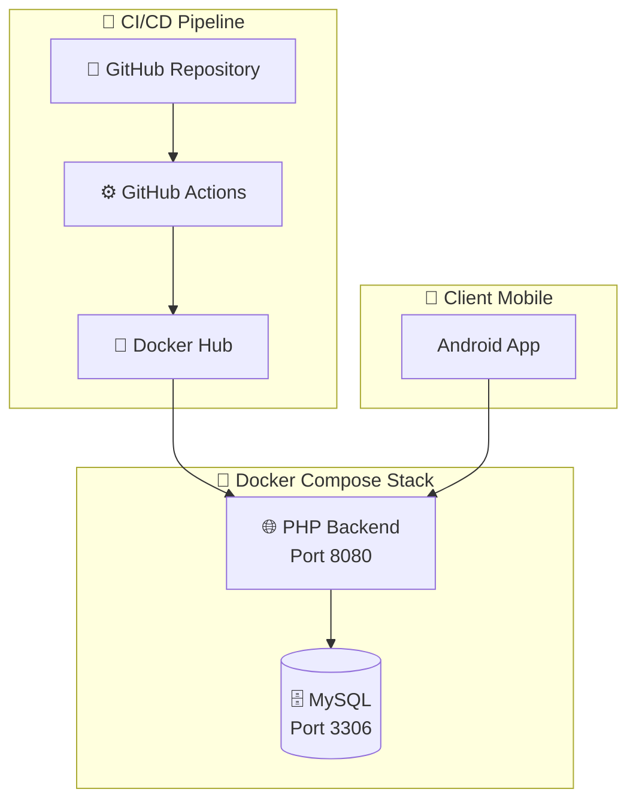
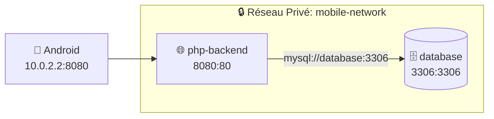
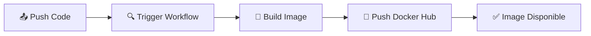
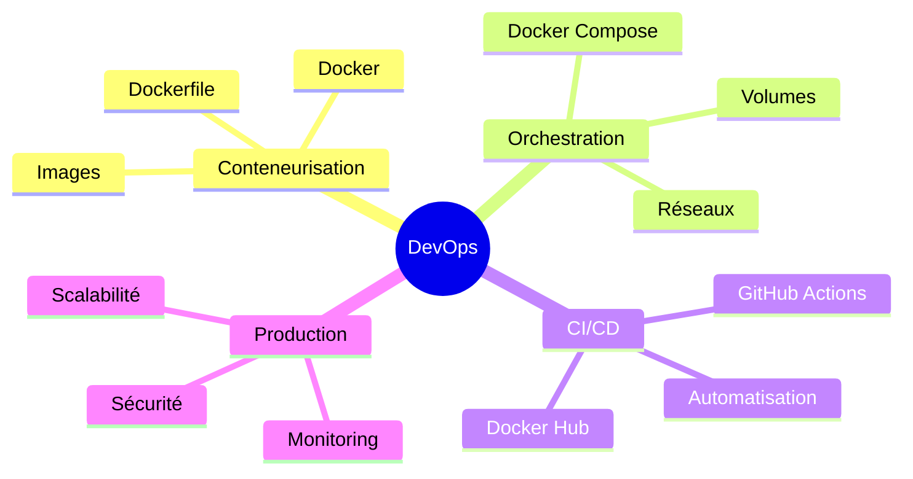

<p align="center">
  
</p>

<h1 align="center">🚀 TP DevOps : Déploiement d'une Architecture Mobile</h1>

<p align="center">
  <strong>Université Ibn Khaldoun – Tiaret</strong><br/>
  Faculté des Sciences Exactes et Informatique<br/>
  Département d'Informatique<br/>
  <em>Master 2 – Génie Logiciel</em>
</p>

<p align="center">
  
  
  
  
</p>

---

## 📋 Informations Générales

| Attribut | Détail |
|----------|--------|
| **Module** | DevOps & Déploiement |
| **Encadrant** | Dr. A. OUARED |
| **Email** | a_ouared@esi.dz |
| **Année Universitaire** | 2025/2026 |
| **Date de Remise** | Janvier 2026 |

---

## 📑 Table des Matières

1. [Introduction et Contexte](#-1-introduction-et-contexte)
2. [Environnement Technique](#-2-environnement-technique)
3. [Module 1 : Persistance des Données](#-3-module-1--persistance-des-données)
4. [Module 2 : Orchestration Docker Compose](#-4-module-2--orchestration-docker-compose-partie-1)
5. [Module 3 : Conteneurisation de l'API](#-5-module-3--conteneurisation-de-lapi)
6. [Module 4 : Orchestration Complète](#-6-module-4--orchestration-complète-partie-2)
7. [Module 5 : Registre Docker Hub](#-7-module-5--registre-dimages-docker-hub)
8. [Module 6 : Intégration Continue](#-8-module-6--intégration-continue-github-actions)
9. [Conclusion et Perspectives](#-9-conclusion-et-perspectives)

---

## 🎯 1. Introduction et Contexte

### 1.1 Problématique Industrielle

Le développement logiciel moderne fait face à des défis majeurs de reproductibilité et de déploiement. Ce TP aborde deux scénarios classiques :

<table>
<tr>
<td width="50%">

**🔴 Scénario A : "Ça marche chez moi"**

Un développeur Backend et un développeur Mobile collaborent. Le code fonctionne parfaitement chez l'un mais génère des erreurs `Connection refused` chez l'autre en raison de configurations différentes.

**Impact** : Perte de 4+ heures de productivité

</td>
<td width="50%">

**🔴 Scénario B : Dépendances non reproductibles**

Une application Python/TensorFlow fonctionne en développement mais échoue lors de démonstrations sur d'autres machines (bibliothèques manquantes, OS différent).

**Impact** : Échec de démonstrations critiques

</td>
</tr>
</table>

### 1.2 Solution : Méthodologie DevOps

> [!TIP]
> **Docker** permet d'encapsuler l'application avec toutes ses dépendances, garantissant un comportement identique sur n'importe quel environnement.

### 1.3 Objectifs Pédagogiques

À l'issue de ce TP, l'étudiant sera capable de :

- ✅ Conteneuriser une base de données avec persistance
- ✅ Orchestrer des services multi-conteneurs avec Docker Compose
- ✅ Créer des images Docker optimisées
- ✅ Publier des images sur Docker Hub
- ✅ Mettre en place un pipeline CI/CD avec GitHub Actions

---

## 🛠 2. Environnement Technique

### 2.1 Stack Technologique

| Outil | Version | Rôle |
|:------|:-------:|------|
| 🐳 Docker | 27.5.0 | Moteur de conteneurisation |
| 📦 Docker Compose | v2.32.3 | Orchestration multi-conteneurs |
| 🗄️ MySQL | 8.x | SGBD relationnel |
| 🐘 PHP | 8.2 | Backend API REST |
| 🌐 Apache | 2.4 | Serveur web |
| 📝 Git | 2.43+ | Contrôle de version |
| ⚙️ GitHub Actions | - | Pipeline CI/CD |

### 2.2 Architecture Cible



---

## 💾 3. Module 1 : Persistance des Données

### 3.1 Objectif

Configurer un conteneur de base de données PostgreSQL avec :
- Contraintes de ressources (RAM, CPU)
- Persistance des données via volumes
- Configuration de production

### 3.2 Commandes Exécutées

```bash
docker run -d \
  --name tp-postgres \
  -p 2345:5432 \
  -e POSTGRES_DB=mobile_backend_db \
  -e POSTGRES_USER=admin \
  -e POSTGRES_PASSWORD=securePass123 \
  --memory="50m" \
  --cpus="1.0" \
  -v "$(pwd)/db_data:/var/lib/postgresql/data" \
  postgres:15
```

### 3.3 Structure de la Base de Données

```sql
CREATE EXTENSION IF NOT EXISTS "uuid-ossp";

CREATE TABLE mobile_sessions (
    device_id UUID NOT NULL PRIMARY KEY,
    model_name VARCHAR(100) NOT NULL,
    last_login TIMESTAMP DEFAULT CURRENT_TIMESTAMP
);

INSERT INTO mobile_sessions (device_id, model_name) 
VALUES (gen_random_uuid(), 'Android Device 1');
```

### 3.4 Questions & Réponses

<details>
<summary><strong>❓ Q1 : Où sont physiquement stockées les données ?</strong></summary>

Les données sont stockées dans le **volume Docker** `db_data` mappé au répertoire local `./db_data/`. Ce mapping permet de conserver les données même après la destruction du conteneur.

</details>

<details>
<summary><strong>❓ Q2 : Que se passe-t-il après suppression du conteneur ?</strong></summary>

| Scenario | Résultat |
|----------|----------|
| **Avec volume** (`-v`) | ✅ Données conservées |
| **Sans volume** | ❌ Données perdues |

</details>

<details>
<summary><strong>❓ Q3 : Analyse des métriques docker stats</strong></summary>

| Métrique | Valeur | Signification |
|----------|--------|---------------|
| CPU % | 0.04% | Utilisation processeur minimale |
| MEM | 19.07MiB/50MiB | 38.15% de la limite |
| NET I/O | 1.17kB/126B | Trafic réseau minimal |
| BLOCK I/O | 0B/4.1kB | Activité disque faible |

</details>

### 3.5 📸 Preuves Visuelles - Module 1

````carousel

<!-- slide -->

<!-- slide -->

<!-- slide -->

<!-- slide -->

````

---

## 🔧 4. Module 2 : Orchestration Docker Compose (Partie 1)

### 4.1 Analyse du Backend

| Aspect | Détail |
|--------|--------|
| **Technologie** | PHP 8.2 / MySQL 8 |
| **Framework** | API REST native |
| **Architecture** | Monolithique |

**Endpoints disponibles :**

| Endpoint | Méthode | Description |
|:---------|:-------:|-------------|
| `/addStudent.php` | `POST` | Créer un étudiant |
| `/viewAllStudents.php` | `GET` | Lister les étudiants |
| `/updateStudent.php` | `PUT` | Modifier un étudiant |
| `/removeStudent.php` | `DELETE` | Supprimer un étudiant |

### 4.2 Configuration docker-compose.yml

```yaml
services:
  database:
    image: mysql:8
    container_name: mobile-mysql-db
    environment:
      MYSQL_DATABASE: ouareddb
      MYSQL_USER: admin
      MYSQL_PASSWORD: securePass123
      MYSQL_ROOT_PASSWORD: rootPassword
    ports:
      - "3306:3306"
    volumes:
      - mysql_data:/var/lib/mysql
    networks:
      - mobile-network
    deploy:
      resources:
        limits:
          memory: 300M
          cpus: '1.0'
```

### 4.3 Problèmes Rencontrés & Solutions

> [!WARNING]
> **Erreur OOM (Out of Memory)** : MySQL 8 nécessite au minimum 256MB de RAM pour l'initialisation. La limite de 50MB du TP provoque un `kill code 137`.

| Problème | Solution |
|----------|----------|
| Erreur OOM (code 137) | Limite mémoire augmentée à 300MB |
| Option `default-authentication-plugin` obsolète | Option retirée (MySQL 8 utilise `caching_sha2_password`) |
| `could not find driver` | Extension PDO MySQL installée dans Dockerfile |

### 4.4 📸 Preuves Visuelles - Module 2

````carousel

<!-- slide -->

<!-- slide -->

<!-- slide -->

<!-- slide -->

<!-- slide -->

<!-- slide -->

````

---

## 📦 5. Module 3 : Conteneurisation de l'API

### 5.1 Dockerfile Optimisé

```dockerfile
FROM php:8.2-apache

# Installation extension PDO MySQL
RUN docker-php-ext-install pdo pdo_mysql

# Activation mod_rewrite Apache
RUN a2enmod rewrite

# Copie du code source
COPY . /var/www/html/

# Permissions appropriées
RUN chown -R www-data:www-data /var/www/html

EXPOSE 80
```

### 5.2 Caractéristiques de l'Image

| Paramètre | Valeur |
|-----------|--------|
| Image de base | `php:8.2-apache` |
| Taille finale | ~708MB (compressée ~176MB) |
| Port exposé | 80 |
| Extensions | PDO, PDO_MySQL |

### 5.3 Build de l'Image

```bash
# Construction
docker build -t mobile-php-api:latest .

# Vérification
docker images | grep mobile-php-api
```

### 5.4 📸 Preuve Visuelle - Module 3


---

## 🌐 6. Module 4 : Orchestration Complète (Partie 2)

### 6.1 Configuration Finale docker-compose.yml

```yaml
services:
  database:
    image: mysql:8
    container_name: mobile-mysql-db
    environment:
      MYSQL_DATABASE: ouareddb
      MYSQL_USER: admin
      MYSQL_PASSWORD: securePass123
      MYSQL_ROOT_PASSWORD: rootPassword
    ports:
      - "3306:3306"
    volumes:
      - mysql_data:/var/lib/mysql
    networks:
      - mobile-network
    deploy:
      resources:
        limits:
          memory: 300M
          cpus: '1.0'

  php-backend:
    build: .
    container_name: mobile-php-api
    ports:
      - "8080:80"
    volumes:
      - ./:/var/www/html/
    depends_on:
      - database
    networks:
      - mobile-network

volumes:
  mysql_data:

networks:
  mobile-network:
    driver: bridge
```

### 6.2 Architecture Réseau



> [!IMPORTANT]
> **Pour les émulateurs Android** : L'IP `10.0.2.2` représente l'hôte depuis l'émulateur. Utilisez cette IP au lieu de `localhost`.

### 6.3 Vérifications Effectuées

- ✅ Communication PHP → MySQL via DNS Docker
- ✅ Réseau bridge isolé `mobile-network`
- ✅ Dépendance `depends_on` fonctionnelle
- ✅ Healthcheck système réussi

### 6.4 📸 Preuves Visuelles - Module 4

````carousel

<!-- slide -->

<!-- slide -->

````

---

## 🐳 7. Module 5 : Registre d'Images Docker Hub

### 7.1 Informations du Repository

| Paramètre | Valeur |
|-----------|--------|
| **Username** | `kirobgt` |
| **Repository** | `kirobgt/mobile-php-api` |
| **URL** | [hub.docker.com/r/kirobgt/mobile-php-api](https://hub.docker.com/r/kirobgt/mobile-php-api) |

### 7.2 Commandes de Publication

```bash
# 1. Tag de l'image
docker tag mobile-php-api:latest kirobgt/mobile-php-api:latest

# 2. Authentification
docker login --username kirobgt

# 3. Push vers Docker Hub
docker push kirobgt/mobile-php-api:latest
```

### 7.3 📸 Preuves Visuelles - Module 5

````carousel

<!-- slide -->

<!-- slide -->

````

---

## ⚙️ 8. Module 6 : Intégration Continue GitHub Actions

### 8.1 Configuration CI/CD

**Fichier** : `.github/workflows/docker-build.yml`

### 8.2 Secrets Configurés

| Secret | Description |
|--------|-------------|
| `DOCKER_USERNAME` | Identifiant Docker Hub |
| `DOCKER_PASSWORD` | Token d'accès sécurisé |

### 8.3 Pipeline Automatisé



### 8.4 Résultats

| Métrique | Valeur |
|----------|--------|
| Exécutions réussies | 3+ |
| Durée moyenne | ~1 min |
| Image publiée | `kirobgt/mobile-php-api:latest` |

### 8.5 📸 Preuves Visuelles - Module 6

````carousel

<!-- slide -->

<!-- slide -->

<!-- slide -->

<!-- slide -->

<!-- slide -->

````

---

## 📊 9. Conclusion et Perspectives

### 9.1 Récapitulatif des Modules

| Module | Objectif | Statut |
|:------:|----------|:------:|
| 1 | Persistance des données | ✅ |
| 2 | Docker Compose (Base) | ✅ |
| 3 | Dockerfile API | ✅ |
| 4 | Orchestration complète | ✅ |
| 5 | Docker Hub | ✅ |
| 6 | GitHub Actions CI/CD | ✅ |
| 7 | Infrastructure VMs | ⏳ |

### 9.2 Compétences Acquises



### 9.3 Perspectives d'Amélioration

1. **Module 7** : Déploiement sur infrastructure VMs avec Load Balancing
2. **Kubernetes** : Migration vers une orchestration plus avancée
3. **Ansible** : Automatisation du provisionnement
4. **Tests** : Intégration de tests automatisés dans le pipeline

---

<p align="center">
  <strong>Université Ibn Khaldoun – Tiaret</strong><br/>
  Master 2 Génie Logiciel – Année Universitaire 2025/2026<br/>
  <em>Module DevOps & Déploiement</em>
</p>

---

<p align="center">
  <sub>📧 Contact encadrant : <a href="mailto:a_ouared@esi.dz">a_ouared@esi.dz</a></sub><br/>
  <sub>📝 Objet email : [TP DevOps] TP2 Nom Prénom</sub>
</p>